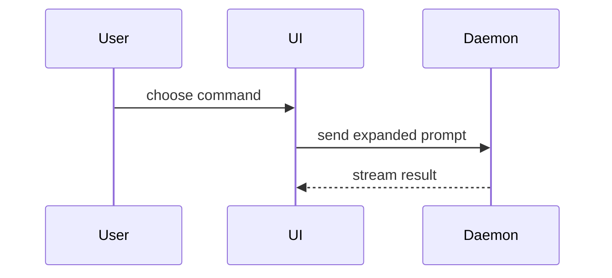

# PR shape

The three sections of a PR body, for a reviewer who hasn't read the ticket or the commits. `pr-ticket` and `autopilot-ticket` both write them. The header lines and `For the reviewer` come from the station's own `SKILL.md`, so they aren't here.

```markdown
## Summary

<one or two lines, what changed and why, in the ticket's words>

<diagram, diff sketch, or tree>

## Evidence

**Before** `<red sha>`, these tests failed.
**After** `<HEAD sha>`, they pass. <what else ran green, such as the whole suite, 214 tests>

- <behaviour, in the ticket's words> `<test file>::<test name>`

## Merge danger

**Door** <one-way or two-way>. <optional, one line on why>

**Blast radius** <one word>. <optional, what a merge could break>
```

Skip preambles and keep prose short. Use the project's terms as `CONTEXT.md` defines them, when the file exists. A reviewer reads the body cold, so never coin a term the code or `CONTEXT.md` doesn't use. Check every line against `unslop`.

## Summary

Lead with one or two lines of prose, then pick the smallest view that makes the change clear. One view is the usual answer and three is the most. Put each view next to the line it supports. Show only the calls, files, props, states and boundaries the reviewer needs. Leave docstrings out of code blocks.

### Feature work gets a sequence diagram

A ticket that adds user-visible behaviour or a new entry point gets a Mermaid `sequenceDiagram`, showing the new path through the components it crosses. Draw the path a user's action takes, not every call in the diff. Skip the diagram only when the feature lives inside one component and crosses no boundary, and then use one of the other views.

Refactors, bug fixes and test-only changes get a diagram only when the change alters which components call each other, or in what order.



GitHub draws a `mermaid` code fence as a diagram, but its Mermaid version trails the current one, and a diagram it can't parse shows as an error box. Stay inside this syntax:

- `participant` and `actor`, with plain one-word names. Never name one `end`.
- `->>` for a call, `-->>` for a reply, `-x` for a failure.
- `alt` / `else` / `end`, `opt` / `end`, `loop` / `end`.
- `Note over A,B: text`.
- No semicolons or `#` in message text. Both break the parser.

### Other views

Logic or an algorithm, as pseudocode:

```text
on(save)
  if content is unchanged
    return cached result
  write new content
  return fresh result
```

Runtime control flow, as a call tree:

```text
submitForm
  createSession
    persistPrompt
    launchAgent
  navigateToSession
```

UI structure, as a component tree with the state and module boundaries that matter:

```text
<SessionPage> (apps/example/src/routes/session.tsx)
  useSessionEvents()
  <SessionToolbar>
    <RunSkillButton> (packages/ui)
```

File responsibility or a broad refactor, as a shallow file tree:

```text
src/
├── commands/       # parses user actions
├── sessions/       # owns session state
└── transport/      # sends API requests
```

### Diff sketches

Use a `diff` fence when the point is what changed and the surrounding shape already exists. Match the sketch to the view it changes.

A component change:

```diff
 <SessionPage>
   useSessionEvents()
   <SessionToolbar>
+    <RunSkillButton />
   <SessionTimeline>
+    <SkillResultCard />
```

A file layout change:

```diff
 src/
 ├── commands/
+│   └── show-me.ts       # expands the slash command
 ├── sessions/
-└── transport.ts
+└── transport/
+    ├── client.ts
+    └── stream.ts
```

A call tree change:

```diff
 submitForm
   createSession
     persistPrompt
+    expandSkillMention
     launchAgent
-  navigateToSession
+  navigateToSession
+    subscribeToEvents
```

A state or control flow change:

```diff
 on(save)
-  write content
+  if content is unchanged
+    return cached result
+  write new content
+  invalidate cache
```

Show a whole code block instead when most of it is new, when cutting context would hide ownership or order, or when the reviewer needs the target shape to copy:

```ts
function expandSkill(command: string): string {
  const skillName = command.slice(1);
  return `use the ${skillName} skill`;
}
```

## Evidence

The tests are the evidence. Before is the red commit, where every test the ticket added was watched failing. After is `HEAD`, where the same tests pass.

- **On the kanban chain**, the red commit is `Architect #<N>:`. The tests have since moved into the module test files `unit-test-ticket` folded them into, so take each one's file at `HEAD` from the `Tests #<N>: tidy and fold` commit or `unit-test-ticket`'s issue comment. Leave dropped tests out. The whole suite ran green, so say so with its count.
- **On autopilot**, the red commit is `Test #<N>:`, and the tests are still where it wrote them. It ran its own tests and the neighbouring tests, not the whole suite, so say exactly that.

List one line per test: the behaviour in the ticket's words, then the test's file and name at `HEAD`. Never claim a test passed or failed without a run or a commit that says so.

## Merge danger

**Door.** A two-way door can be walked back by reverting the merge. A one-way door can't: a data migration, a deleted column, a published API or file format, a message sent to users. Say which, and for a one-way door, name what can't be undone.

**Blast radius.** One word for how far a bad merge reaches, such as `module`, `service`, `consumers` or `users`. Then a line on what could break: callers of a changed signature, stored data, layout on small screens, a config other repos read. Think past the diff to what reads its output.
